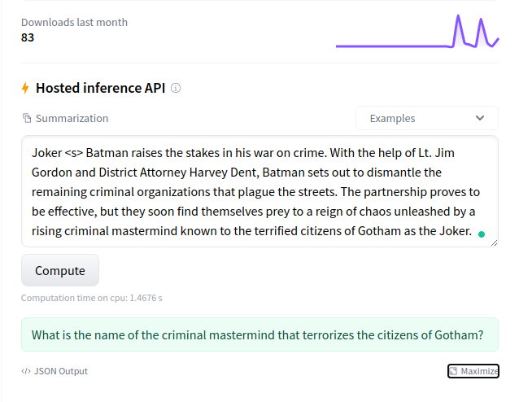
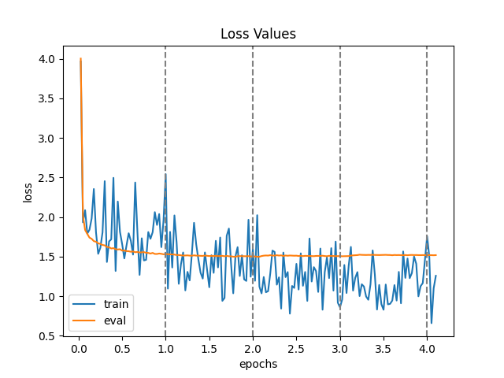
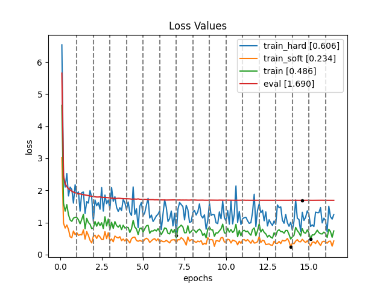

# Introduction

Question Generation is the task of generating a question for a given answer-context pair. This repository contains the code to setup a pipeline to finetune and distill a Transformer model checkpoint for the task using the [HuggingFace](https://huggingface.co/) library along with other required utilities. More specifically, I've fine-tuned and distilled the distilbart summarization model checkpoint (`sshleifer/distilbart-cnn-6-6`) on the SQuAD dataset. The codebase is fairly generalized and can be used for other tasks as well with small changes.

# Demo Links

* **[Finetuned 6-6 QGen Model](https://huggingface.co/gpssohi/distilbart-qgen-6-6)**
* **[Distilled 3-3 QGen Model](https://huggingface.co/gpssohi/distilbart-qgen-3-3)**



# TODO / Pending Tasks

* Distributed Training Setup
* ONNX Optimization [not available in hgfc for generation]
* AMP Support
* Hosting using Streamlit / Gradio

# Dataset

The goal of Question Generation is to generate a valid and fluent question according to a given passage and the target answer. Hence, the input to the model will be a passage context and an answer, and the output / target will be the question for the given answer. Question Generation can be used in many scenarios, such as automatic tutoring systems, improving the performance of Question Answering models and enabling chat-bots to lead a conversation. The final dataset is created by taking the union of the following Question Answering Datasets. The dataset must have the following three columns: context, question, answer.

## [SQuAD](https://rajpurkar.github.io/SQuAD-explorer/)

Stanford Question Answering Dataset (SQuAD) is a reading comprehension dataset, consisting of questions posed by crowd-workers on a set of Wikipedia articles, where the answer to every question is a segment of text, or span, from the corresponding reading passage, or the question might be unanswerable. We use the SQuAD 1.1 variant which does not have unanswerable questions. So, every question will have a corresponding answer and vice-versa.

### Preprocessing

The first step is to remove questions that don't have answers. After that, we split the train set into Train and Eval sets and treat the dev set as the test set.

### Stats

**Original Dataset**

| Split | Num Docs | Num Contexts | Ques w/ Ans | Ques w/o Ans | Num Unique Ans |
| ----- | -------- | ------------ | ----------- | ------------ | -------------- |
| Train | 442      | 19035        | 86821       | 43498        | 86821          |
| Dev   | 35       | 1204         | 5928        | 5945         | 10279          |

**After Preprocessing**

| Split | Num Rows |   Context  | Answer | Question |
| ----- | -------- | ---------- | ------ | -------- |
| Train | 80995    | 653,120,20 | 43,3,1 | 40,10,1  | 
| Eval  | 5826     | 445,123,67 | 28,3,1 | 29,10,3  |
| Test  | 10297    | 629,129,25 | 29,4,1 | 31,10,3  |

The numbers in the columns indicate max, avg, min number of words.

## [Natural Questions](https://ai.google.com/research/NaturalQuestions) [Not Used]

The Natural Questions corpus is a question answering dataset by Google. Each example is comprised of a google.com query and a corresponding Wikipedia page. Each Wikipedia page has a passage (or long answer) annotated on the page that answers the question and one or more short spans from the annotated passage containing the actual answer. The long and the short answer annotations can however be empty. If they are both empty, then there is no answer on the page at all. If the long answer annotation is non-empty, but the short answer annotation is empty, then the annotated passage answers the question but no explicit short answer could be found. Finally 1% of the documents have a passage annotated with a short answer that is “yes” or “no”, instead of a list of short spans.

## [TriviaQA](http://nlp.cs.washington.edu/triviaqa/) [Not Used]

TriviaQA is a realistic text-based question answering dataset which includes 950K question-answer pairs from 662K documents collected from Wikipedia and the web. This dataset is more challenging than standard QA benchmark datasets such as Stanford Question Answering Dataset (SQuAD), as the answers for a question may not be directly obtained by span prediction and the context is very long. TriviaQA dataset consists of both human-verified and machine-generated QA subsets.

# Training and Distillation

|                  Training               |                   Distillation              |
| --------------------------------------- | ------------------------------------------- |
|  |  |

# Directory Structure

```bash
|-- README.md
|-- environment.yaml
|-- data
|	|-- squad
|	|	|-- raw
|	|	|	|-- train-v2.0.json
|	|	|	|-- dev-v2.0.json
|	|	|-- processed
|	|	|	|-- [processed data files]
|	|	|	|-- splits
|	|	|	|	|-- train.tsv
|	|	|	|	|-- eval.tsv
|	|	|	|	|-- test.tsv
|	|	|	|	|-- lmdb*
|	|	|	|	|	|-- train.lmdb*
|	|	|	|	|	|-- eval.lmdb*
|	|	|	|	|	|-- test.lmdb*
|-- data-format
|	|-- squad.py
|-- data-utils
|	|-- proto
|	|	|-- data_item.proto
|	|	|-- data_item_pb2.py*
|	|-- data_stats.py
|	|-- create_lmdb.py
|-- src
|	|-- util.py
|	|-- plotting.py
|	|-- dataset.py
|	|-- distribute.py
|	|-- train.py
|	|-- evaluate.py
|	|-- predict.py
|	|-- generate.py
|	|-- distill.py
|-- config
|	|-- train.config
|	|-- eval.config
|	|-- pred.config
|	|-- distill.config
|-- vis
|	|-- tsv_viewer.py
|-- stats
|	|-- [stats related files]
|-- benchmark
|	|-- benchmark.py
|	|-- wordlist.txt
|	|-- results.txt
|-- logs
|	|-- train
|	|	|-- run_4 [20 epochs, no scheduler]
|	|	|-- run_6 [4 epochs and scheduler]
|	|-- pred
|	|	|-- run_2 [default decoding params]
|	|	|-- run_3 [adjusted decoding params]
|	|	|-- run_4 [dynamic quantized pred]
|	|	|-- run_5 [distilled w/ run_3 params]
|	|-- distill
|	|	|-- run_21 [16 epochs and scheduler]

* : file created programmatically
```

# Commands to run

```bash

# first set up the environment using .yaml file included in the repo

# download the raw dataset from the SQuAD website
# https://rajpurkar.github.io/SQuAD-explorer/

# preliminary stats on the squad dataset
# cd data-format
python3 squad.py --input_dir ../data/squad/raw/ --task raw_stats

# prepare squad question answering data for consumption by converting to tsv
# cd data-format
python3 squad.py --input_dir ../data/squad/raw/ --output_dir ../data/squad/processed/ --task json2tsv

# at this point manually split the train set into train and eval in ./splits
# follow the directory structure shown above

# fetch initial stats on the dataset
# cd data-utils
python3 data_stats.py --input_path ../data/squad/processed/splits/ --output_path ../stats/squad/

# take a look at a few samples of the dataset for sanity
# cd vis
streamlit run tsv_viewer.py -- --input_path ../data/squad/processed/splits/eval.tsv

# convert the tsv data into lmdb database for efficient loading
# cd data-utils
python3 -m grpc_tools.protoc -I./proto --python_out=./proto ./proto/data_item.proto
python3 create_lmdb.py --input_path ../data/squad/processed/splits/ --output_path ../data/squad/processed/splits/lmdb/

# training routine [adjust params in config]
# cd src
python3 train.py --config_filename ../config/train.config

# distillation routine [adjust params in config]
# cd src
python3 distill.py --config_filename ../config/distill.config

# evaluation routine [adjust params in config]
# cd src
python3 evaluate.py --config_filename ../config/eval.config

# get predictions [adjust params in config]
# cd src
python3 predict.py --config_filename ../config/pred.config

# to get interactive predictions [adjust params in config]
# cd src
python3 generate.py --config_filename ../config/pred.config

# view the results using streamlit
# cd vis
streamlit run tsv_viewer.py -- --input_path ../logs/pred/run_6/eval.tsv

```

# Huggingface Hub

1. Instructions on uploading model to hub. [Link](https://huggingface.co/docs/transformers/model_sharing)
	- Remember to update the default config file with required decoding parameters.
2. Link to my finetuned 6-6 QGen Model. [Link](https://huggingface.co/gpssohi/distilbart-qgen-6-6)
3. Link to my distilled 3-3 QGen Model. [Link](https://huggingface.co/gpssohi/distilbart-qgen-3-3)
